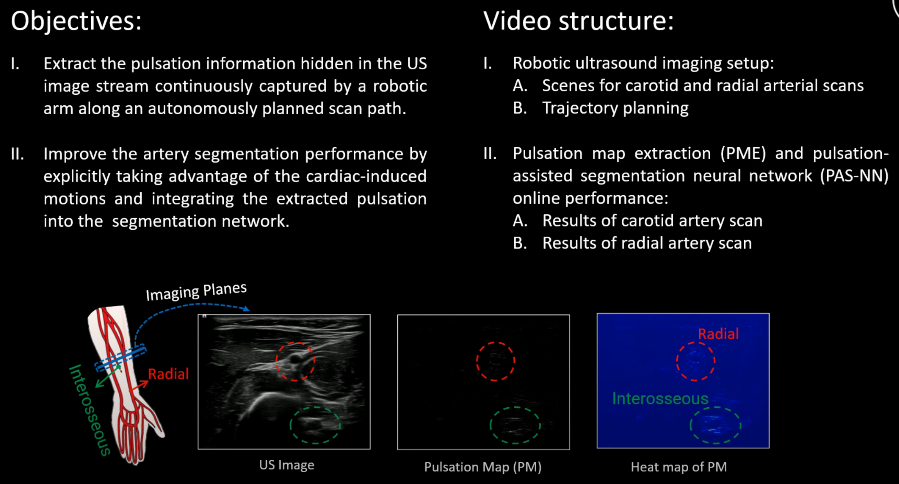

<!--
 * @Author: Dianye dianye.huang@tum.de
 * @Date: 2023-07-04 16:39:19
 * @LastEditors: Dianye dianye.huang@tum.de
 * @LastEditTime: 2023-07-04 17:59:07
 * @FilePath: /Github_Codes/readme.md
 * @Description: This is a readme file
-->

# PAS-NN for Robotic Ultrasound

#### Motion Magnification in Robotic Sonography: Enabling Pulsation-Aware Artery Segmentation

#### Introduction
This work presents a novel pulsation-assisted segmentation neural network (PAS-NN) by explicitly taking advantage of the cardiac-induced motions. Motion magnification techniques are employed to amplify the subtle motion within the frequency band of interest to extract the pulsation signals from sequential US images. 
<div align="center">

</div>
A robotic arm is utilized to acquire the ultrasound images stably. 
<div align="center">

</div>

#### Video Demo
[](https://www.youtube.com/embed/cLeN-TGS1f8)


#### Repository description
This repository includes codes for implementing the pulsation-map algorithm and the pulsation-assisted segmentation neural network (PAS-NN) architecture. 

- Steps for implementing the pulsation-map algorithm
<div align="center">

</div>

- The PAS-NN consists of two decoder and a decoder. The pulsation guidance information is integrated into the network by the skip connection and attantion gates mechanisms.
<div align="center">

</div>

##### File structure
```
├── readme.md
└── scripts
    ├── accmag_main_gpu.py
    ├── accmag_ros_gpu.py
    ├── accmag_utils_gpu.py
    ├── MagNet.py
    └── pmasnn_ros.py
```
- **accmag_main_gpu.py**: implementation of the Pulsation Map Extraction algorithm
- **accmag_ros_gpu.py**: bridge the PME algorithm with ROS
- **accmag_utils_gpu.py**: utilities for the implementation of PME algorithm
- **MagNet.py**: implementation of the PAS-NN architecture
- **pmasnn_ros.py**: bridge the PAS-NN network with ROS


#### Citation
If you found this work interesting and adopted part of it to your own research, or if this work inspires your research, you can cite our paper by:

```
@inproceedings{pasnn23,
  title     = {Motion Magnification in Robotic Sonography: Enabling Pulsation-Aware Artery Segmentation},
  author    = {Dianye, Huang and
               Yuan, Bi and
               Nassir, Navab and
               Zhongliang, Jiang},
  booktitle = {IEEE/JRS Conference on Intelligent Robots and Systems (IROS)},
  year = {2023}
}
```
